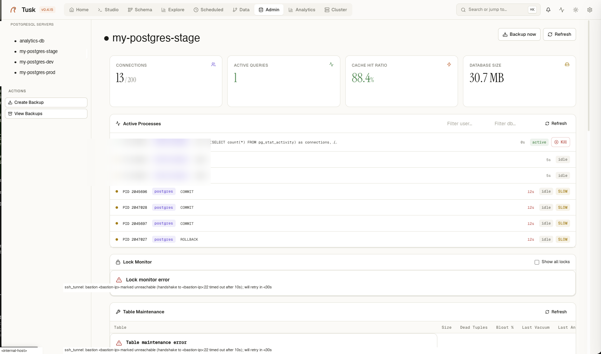

# Admin

A PostgreSQL DBA console: real-time process list, lock monitor, table maintenance, settings viewer, role manager, backups. The kind of work that usually lives in pgAdmin or Datadog Database Monitoring, here in one tab.

{ .screenshot }

*Admin — Postgres console with processes, locks, settings, backups.*

## Top-bar stats (per connection)

For the active Postgres connection, four KPI cards:

| Card | Source | Meaning |
|---|---|---|
| **Connections** | `pg_stat_activity` count vs `max_connections` | How saturated the connection pool is. Yellow at >70%, red at >90%. |
| **Active queries** | `pg_stat_activity` where `state = 'active'` | How many queries are in flight right now. |
| **Cache hit ratio** | `pg_stat_database.blks_hit / (blks_hit + blks_read)` | The single best Postgres health number. Sustained <90% means your working set doesn't fit in shared_buffers — time to look at indexes or RAM. |
| **Database size** | `pg_database_size(...)` | Total disk footprint. |

`Refresh` re-polls all four. `Backup now` jumps to the Create Backup dialog (see [Backups](#backups) below).

## Active processes

A live table of every row in `pg_stat_activity` that isn't your own connection. Each row:

- **PID** + status dot (green = active, amber = idle / idle-in-tx, gray = waiting).
- **Database name** chip.
- **Query text** (truncated to ~80 chars; click to expand).
- **Duration** (how long since `query_start`).
- **State** badge — `active`, `idle in tx`, `idle`, `waiting`, etc.
- A **Kill** button (right side, red) that runs `pg_terminate_backend(pid)` after confirmation.

Filters above the table let you narrow by user (`Filter user…`) or database (`Filter db…`) — useful on shared instances where you only want to see your own app's connections.

## Lock monitor

Shows blocking lock chains derived from `pg_locks` + `pg_stat_activity`. When something is blocked-waiting, the offending lock holder shows up here.

If the connection itself is unreachable (e.g. the SSH tunnel is down because the bastion's Security Group dropped your IP — [post-mortem](https://github.com/tuskdata/tuskdata/blob/main/specs/bugs/2026-05-18-ssh-tunnel-hangs-admin.md)), the lock monitor renders an inline error banner instead of a perpetual spinner:

> ⚠️ **Lock monitor error**
> `ssh_tunnel: bastion <ip> marked unreachable (...); will retry in <30s`

Same banner pattern is used everywhere: Active Processes, Table Maintenance, Extensions, Settings — every panel that needs the database. The contract is "never leave a panel spinning".

## Table maintenance

Per-table view of bloat + maintenance recency. Columns:

- **Table** (`schema.name`).
- **Size** (`pg_relation_size`).
- **Dead tuples** (`n_dead_tup` from `pg_stat_user_tables`).
- **Bloat %** (estimated from dead-tuple-to-live-tuple ratio).
- **Last vacuum** / **Last analyze** (relative time).
- **Actions**: VACUUM (regular), VACUUM FULL, ANALYZE, REINDEX. Each runs in a background job ([job watchdog](https://github.com/tuskdata/tuskdata/blob/main/specs/architecture/adrs/0001-single-process-by-default.md) caps it at 1h so a stuck operation doesn't tie up a worker).

## Extensions

Lists every extension from `pg_available_extensions`, marking which are currently installed. Install / uninstall via one-click buttons (admin auth required). `Show available` toggles between "only installed" and "all available".

## Database settings

Reads `pg_settings`. Each row: setting name, current value, default, category, description, and an action to override (where `context = user` or `superuser`). For `restart`-context settings, the UI shows a "requires restart" badge.

`Filter…` does a substring match across name + description. `Show all` flips between the curated "important" subset (~30 settings DBAs actually look at) and the full ~300-row list.

## Scheduled tasks

Cron-style jobs scoped to this connection. Add with `+ Add Schedule`. Each row shows:

- Job name / description
- Cron expression (`*/15 * * * *`)
- Status: active / paused
- Last run + duration
- Next run

Backed by the same APScheduler instance the whole studio uses. Background work is bounded by per-kind `max_duration_s` defaults — see [`tusk.core.jobs`](https://github.com/tuskdata/tuskdata/blob/main/src/tusk/core/jobs.py).

## Roles & Users

The Postgres native side of access control (different from the application-level RBAC in [tusk-bi](analytics.md)). Lists `pg_roles`, lets you create / drop / alter login / superuser / replication / connection_limit. Each row:

- Role name
- Login (yes/no)
- Superuser (yes/no)
- Create DB / Create Role flags
- Member-of (parent roles)
- Actions menu

## Backups

`Backup now` opens a dialog that shells `pg_dump -F c | gzip` to a file in `~/.tusk/backups/<conn>/<timestamp>.sql.gz`. The actual dump runs in a background job (the route returns 202 + `job_id` immediately so the UI never freezes). Progress streams to the global activity drawer.

Backups visible in the **View backups** panel show three states:

- **Verified** (green) — sidecar metadata says the dump completed cleanly.
- **Empty** (red) — the file is < 100 bytes; pg_dump silently produced nothing (typically a client/server version mismatch). [Post-mortem here](https://github.com/tuskdata/tuskdata/blob/main/specs/bugs/2026-04-30-backups-hang-and-lie.md).
- **Unverified** (neutral) — file exists but no sidecar metadata (older backups from before v0.4.10).

Restore: `Restore...` lets you pick a backup file + target connection. Cross-connection restore is supported (you can dump prod and restore into a local staging connection for diagnostics).

For backups through an SSH tunnel (RDS behind a bastion), see [the SSH-tunnel section in deployment](#ssh-tunnels) — it works transparently, the tunnel is auto-resolved before `pg_dump` is invoked.

## Why Admin matters

The pitch is **"one tab, every common PG admin task"**. pgAdmin is a desktop app. Datadog DB Monitoring is paid and remote. Tusk Admin is what your home-grown internal admin page would have been if you had three months to build it — except it already exists.

## SSH tunnels

Every Postgres connection can optionally route through an SSH bastion. The tunnel manager:
- Reuses one asyncssh session across multiple connections that share a bastion (single handshake instead of N).
- Caches "broken bastion" state for 30s after a failed handshake so a flood of admin polls doesn't each pay a fresh 10s timeout.
- Surfaces unreachable bastions inline in the affected admin panel, not as a generic 500.

See [`bugs/2026-05-18-ssh-tunnel-hangs-admin.md`](https://github.com/tuskdata/tuskdata/blob/main/specs/bugs/2026-05-18-ssh-tunnel-hangs-admin.md) for the post-mortem on the day the tunnel cache *wasn't* doing those things.

## Related

- [studio.md](studio.md) — the "Query in Studio" buttons across Admin panels target this.
- [analytics.md](analytics.md) — for dashboard-style monitoring views rather than the live process list.
