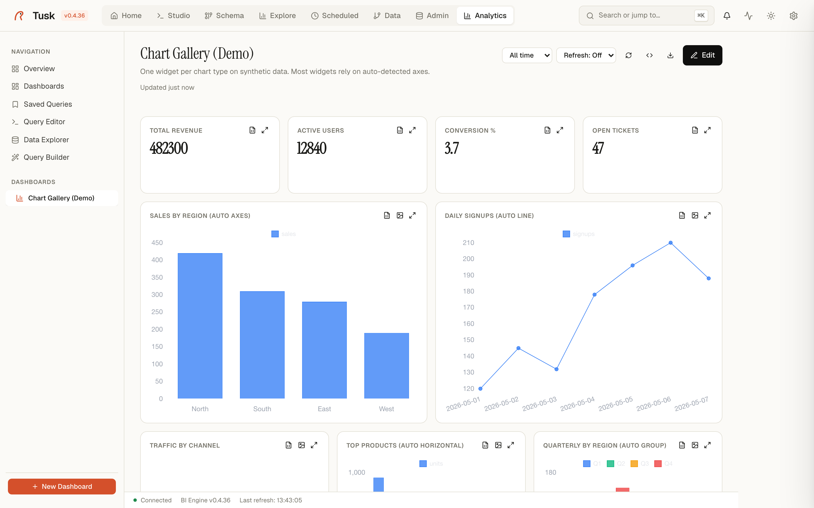
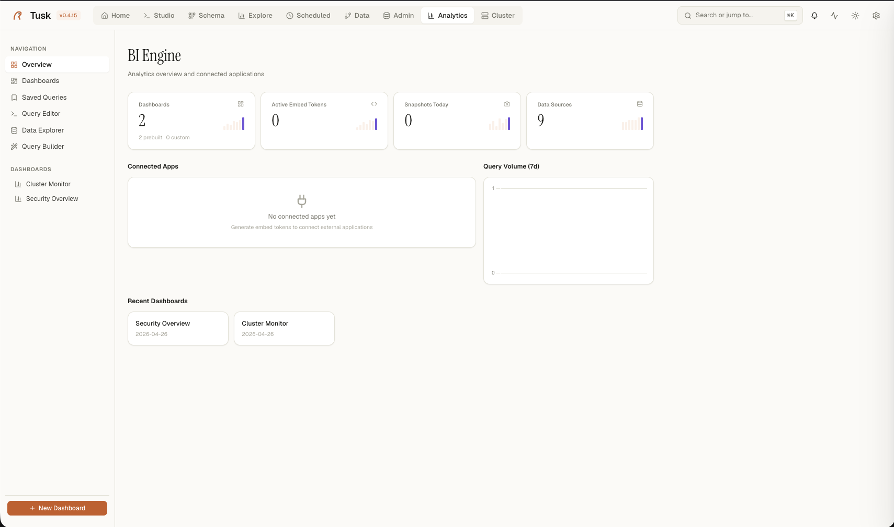

# Analytics

{ .screenshot }

Dashboards, saved queries, data sources, scheduled snapshots, embed tokens. The BI side of Tusk lives here. Built into TuskData since 0.4.36 (it started life as the `tusk-bi` plugin; nothing to install).

{ .screenshot }

*Analytics — BI Engine overview with dashboards and embed tokens.*


## Layout

A sidebar nav + a content area:

```
NAVIGATION
─ Overview         ← you are here
─ Dashboards
─ Saved Queries
─ Query Editor
─ Data Explorer
─ Query Builder

DASHBOARDS
─ Cluster Monitor      (prebuilt)
─ Security Overview    (prebuilt)
─ <your dashboards>
```

`+ New Dashboard` at the bottom of the sidebar.

## Overview page

Four KPI tiles + two charts + a recent-dashboards strip:

| Tile | What it counts |
|---|---|
| **Dashboards** | Total dashboards in this Tusk instance, with a count of prebuilt vs custom |
| **Active Embed Tokens** | Live `embed_tokens` rows that haven't expired |
| **Snapshots Today** | Scheduled-query result snapshots produced in the last 24h |
| **Data Sources** | Registered data sources (Postgres connections + DuckDB + any plugin-exposed dataset) |

Below the tiles:

- **Connected Apps**: empty state when no embed tokens have been issued. Once you generate one, this fills with cards for each consuming app.
- **Query Volume (7d)**: line chart of queries run through the BI engine across the last week.
- **Recent Dashboards**: clickable cards for the dashboards you've touched most recently.

## Dashboards

The viewer + editor for individual dashboards. Two layouts:

- **Editor**: GridStack-based drag/resize, three-panel UI (widget library · canvas · widget config). Used when you're building.
- **Viewer**: CSS-grid based static layout. Lightweight, no GridStack JS load. What end users see.

A dashboard is a JSON document (exportable / re-importable). Each widget has:

- A **widget type**: `stat` · `chart` · `table` · `pivot` · `top_n` · `funnel` · `map` · `text`
- A **SQL query** (or reference to a saved query)
- A **size** in the 12-column grid (`span-3` to `span-12`)
- An optional **filter set** (dropdowns / date range / text) that scopes the query

Header chrome (the v0.3.0 redesign):

- Title (serif font)
- Description
- Last-updated meta + Live badge (when `refresh_interval_seconds > 0`) + Public badge (when `is_public = true`)
- Filter dropdown · Refresh · Embed · Export · **Edit**

## Widget types

| Type | Data shape | Use when |
|---|---|---|
| **stat** | `SELECT <number>` (1 row, 1 column) | MRR, active users, single-metric KPI. Sparkline auto-derived from snapshot history. |
| **chart** | `SELECT label, value [, group]` | Line / bar / area / donut. Auto-picks based on x-axis type. |
| **table** | Any | Sortable result table with conditional formatting rules. |
| **pivot** | `SELECT row_dim, col_dim, value` | Pivot cross-tab with sum / avg / count aggregation. |
| **top_n** | `SELECT label, value` | Horizontal bar list — top countries, top products, top users. |
| **funnel** | `SELECT stage, count` ordered DESC | Conversion / step drop-off — pipeline funnel, signup funnel. |
| **map** | `SELECT lat, lng [, value, label]` | MapLibre point map; `map_style: 'bubbles'` sizes circles by value with inline labels. |
| **text** | (none) | Markdown notes, section headers. |

## Data sources

The `Data Sources` page (under the sidebar nav) lists everything BI can query against:

- Every Postgres connection registered in the main Tusk app.
- The local DuckDB engine.
- Any **plugin-exposed dataset** — e.g. tusk-cluster's worker stats. Plugins declare their datasets via `TuskPlugin.get_datasets()` and they appear here automatically.

You can run a query against any data source from the Query Editor / Query Builder.

## Saved queries

Reusable SQL templates. Each saved query has:

- Name + description
- The source it runs against
- The SQL body
- An optional chart config (so re-running automatically re-charts)
- An optional schedule (cron expression — the result becomes a `snapshot` row, feeding stat-widget sparklines and freshness badges)

## Embed tokens

Generate a short-lived token to embed a dashboard into an external app via iframe. Each token carries:

- **Dashboard ID** to render
- **`app_id`** (free-form, just for tracking who issued it)
- **`expires_in_seconds`**
- **`rls_clauses`** — a `{column: value}` map that scopes every query the embed runs (e.g. `{"tenant_id": "42"}` makes the dashboard show only tenant 42's data)

Use case: a SaaS product giving each of its customers a "their data" dashboard. You issue a token per session, customer sees only their rows.

Embedding stays at this level on purpose: an iframe and a token. There is no
React/Vue SDK and none is planned.

## Dashboards as files

```bash
tusk bi export all --out dashboards/     # one YAML per dashboard: widgets + queries
tusk bi import dashboards/*.yaml         # replaces a dashboard with the same name
```

Keep them in git, review changes, apply on a fresh instance. `--json`
writes JSON instead; both formats are what the dashboard export endpoint
returns.

## Why Analytics matters

Most data tools treat dashboards as the **end** of the workflow: build, share, done. Tusk treats them as **just another view** alongside Studio (raw SQL) and Explore (auto-profile). The same query you write in Studio becomes a widget here; the same connection you use for admin powers the dashboard. One product, one mental model.

## Related

- [studio.md](studio.md) — write the SQL once here, save it, embed it as a widget there.
- [explore.md](explore.md) — confirm a column shape before wiring it into a widget.
- How and why it moved into core: [`specs/roadmap/later/tusk-bi-to-core.md`](https://github.com/tuskdata/tuskdata/blob/main/specs/roadmap/later/tusk-bi-to-core.md).
