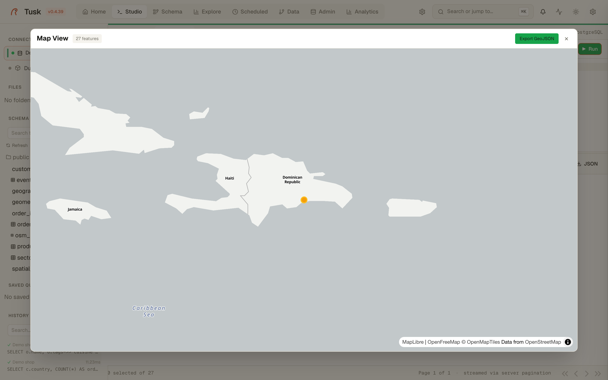

# AI Copilot

{ .screenshot }

Ask a question in plain language, get SQL for the connection you are on,
open it in a new tab, run it. The Copilot also explains a query, reads an
EXPLAIN plan ([Studio](studio.md)), and answers agents through the
[MCP server](mcp.md) with the same grounding.

It runs against **your** provider: Ollama on your machine or LAN, any
OpenAI-compatible endpoint, or Anthropic. Configure it in **Settings → AI**;
nothing leaves your network unless you point it outside.

## What the model is told

The difference between a useful answer and a confident hallucination is
what goes into the prompt. For every question the Copilot builds:

- **Available tables** — every table with its column and row counts, the
  ones matching the question first.
- **Detailed schema** — columns, types, primary and foreign keys for the
  tables the question names (plus one FK hop), within a size budget.
- **Spatial** (PostGIS databases) — the PostGIS version, every geometry
  and geography column with its type and SRID, tables with lat/lon
  columns, and a short PostGIS cheat sheet. Tables with geometry are
  always detailed: a question about restaurants never names the OSM table.
- **Column values (sampled)** — for `jsonb` columns (OSM-style tag bags) and
  categorical text columns, the keys and values that actually occur:
  `amenity: restaurant | cafe | bar`, `diet:vegetarian: yes | only`.
  Categorical keys come first; names, addresses, contacts and dates are
  left out. Sampled from 5 000 rows, cached ten minutes per connection.
- **Places mentioned in the question** — capitalised words and phrases
  are looked up in tables that look like places (a polygon or point plus a
  name column). The prompt then says *"Piantini" → sectors.name =
  'Piantini' (geometry column: geom)*, so the model filters on the exact
  value instead of guessing the spelling or the casing.
- **Previous turns** of the conversation on this connection.

Example on the demo database (OpenStreetMap POIs of Santo Domingo plus
neighbourhood polygons), with a 9B local model:

> quiero que me enseñes todos los restaurantes de tipo vegetariano que se
> encuentren en el sector Piantini

```sql
SELECT o.name, o.tags, o.geom, s.name AS sector_name
FROM osm_pois o JOIN sectors s ON ST_Contains(s.geom, o.geom)
WHERE s.name = 'Piantini'
  AND o.tags->>'amenity' = 'restaurant'
  AND o.tags->>'diet:vegetarian' IN ('yes', 'only')
```

Because the SELECT keeps the geometry, Studio opens the **map** view
when the query runs.

{ .screenshot }

## Limits, honestly

- The grounding is only as good as the data: a `tags` column full of
  empty arrays profiles to nothing.
- Small models still invent a join now and then when the schema is thin.
  The `confidence` field is the model's own estimate; treat *low* as "ask
  which table".
- Place lookup is by name, case-insensitive, first table with a hit. Two
  areas with the same name (a province and a district) are both listed;
  the model picks, and the `level`/`kind` column shown next to each match
  is there to help it.
- Prompts are capped at 4 096 characters and the Ollama context at 16k
  tokens (`TUSK_AI_NUM_CTX`); a grounded prompt on a 200-table database is
  around 4k tokens.

## Memory and audit

Conversation turns are stored per connection and per browser session
(`Clear memory` in the panel forgets them). Prompts that try to plant
instructions for later turns are rejected. `tusk ai stats` reports how
often generated SQL was kept, edited or discarded.
