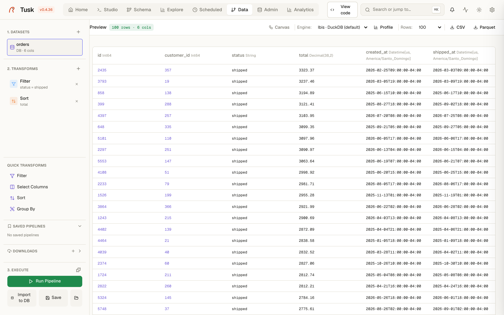

# Data

{ .screenshot }

The Data page is a small, visual ETL: load something, apply a few
transforms, look at the result, and either export it, import it into
PostgreSQL, or save the whole thing as a pipeline that [Scheduled](scheduled.md)
can run every night. Polars does the work in-process; nothing is staged
in a database unless you ask for it.

## Sources

- **Files** — CSV, Parquet, JSON, XML, ZIP (drag and drop, or a path on the
  server). Geo files are detected and projected coordinates reprojected.
- **PostgreSQL** — a table, or a custom query, from any connection.
- **DuckDB / SQLite** — a database file.
- **Open Data** — public sources (OpenStreetMap layers by bounding box,
  government catalogs) fetched by the download manager.
- **Plugin datasets** — anything a plugin publishes.

## Transforms

Filter, select and rename columns, sort, limit, distinct, drop nulls,
computed columns from an expression, group-by aggregations, window
functions (rank, row number, lag/lead, cumulative sums), join with a file or
another dataset, union/concat. Each transform shows its effect immediately
in the preview.

**Generated code** shows the equivalent Polars script for the pipeline —
copy it into a notebook when the visual editor is not enough.

## Outputs

- **Export** to CSV, Parquet (optionally partitioned) or GeoJSON.
- **Import to database** — create or append to a PostgreSQL table
  (streamed, so large files do not need to fit in memory twice).
- **Materialize** into DuckDB for analytics.
- **Save pipeline** — the source + transforms, replayable from the page or
  from a scheduled job. Pipelines are stored per user.

## Limits worth knowing

Uploads are rate-limited (10/min) and cleaned from the temp folder with
exports. Very wide transforms on files larger than memory are not the
target here — that is what DuckDB in [Studio](studio.md) is for.
