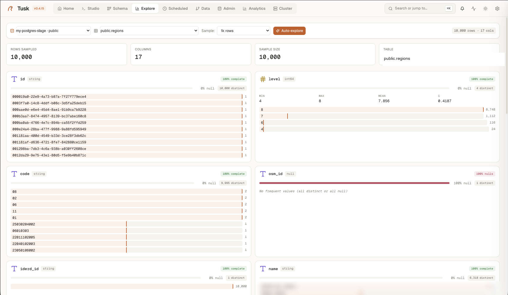

# Explore

A one-click profile of any table: per-column distribution, null ratios, distinct counts, sample values. Think `pandas-profiling` but inline and SQL-agnostic.

{ .screenshot }

*Explore — auto-profile of a table with per-column stats and histograms.*


## How it works

Pick a connection + table + sample size. Tusk runs a series of cheap `SELECT` queries against your data (with `LIMIT` and `TABLESAMPLE` where applicable to keep cost bounded), aggregates the results client-side, and renders one card per column.

Example flow from the screenshot:

- **Connection**: `<your postgres>` · `<schema>`
- **Table**: `public.regions`
- **Sample size**: `1k rows` (other options: 5k, 10k, 100k, full table)
- Click **Auto-explore** → ~2-5 seconds later you have a profile.

Top of the page shows the header tile: rows sampled, total columns, table identifier.

## Per-column cards

Each card is sized by column type — strings render their top values + frequency, numerics render min/max/mean/Σ + a histogram, booleans render a bar pair, dates render a year-month timeline.

A typical card:

```
┌─────────────────────────────────────────────────────┐
│ T  level   int64           100% complete  4 distinct │
│ ─────────────────────────────────────────────────────│
│ MIN     MAX      MEAN    Σ                          │
│  4       8       7.856   0.4187                     │
│                                                     │
│ 8  ████████████████████████████████████████  8,748  │
│ 7  ████████                                  1,112  │
│ 6  ▌                                            116 │
│ 4  ▏                                             24 │
└─────────────────────────────────────────────────────┘
```

The strip below the header has two stats: **% complete** (1 − null ratio) and **distinct value count**. A red bar with `100% nulls` is a quick visual flag that the column is empty in your sample.

## What the cards adapt to

| Column shape | Card style |
|---|---|
| Categorical (string, < 50 distinct) | Top-N frequency bars |
| Numeric (int / float / numeric) | Min/max/mean, total, histogram |
| Boolean | Two bars, true vs false |
| Date / timestamp | Year-month timeline |
| High-cardinality string (≥ 50 distinct) | Just the first 10 sample values + the distinct count |
| All-null | Red "100% null" banner, no further detail |

## When to use it

- **First contact with a table** — you want to know what's actually in it before writing a query.
- **Data quality spot-check** — sudden spike in nulls or distinct-count drift suggests an upstream regression.
- **Picking a join key** — the distinct-count + null-ratio + sample-value combo tells you whether a column is safe to join on.
- **Pre-flight for a dashboard widget** — confirm the column shape before wiring it into a Top-N or Funnel widget in [Analytics](analytics.md).

## When NOT to use it

- **For business metrics** — Explore samples your data; numeric aggregates are approximate. Use [Studio](studio.md) for exact aggregates.
- **For tables you query every day** — it's exploratory. Saved queries + dashboards are the right answer for recurring questions.

## Performance notes

- Sample size capped at 100k rows; beyond that, the cost-vs-signal trade-off goes the wrong way.
- For tables > 1M rows, prefer **5k rows** sample — the distributions stabilize fast.
- All Explore queries respect the connection's `statement_timeout` and the per-request `RequestTimeoutMiddleware` budget. If they take too long, the page returns a 504 cleanly rather than hanging.

## Related

- [schema.md](schema.md) — for the model view; Explore is the data view.
- [studio.md](studio.md) — the "Query in Studio" button on each card opens an editor with a `SELECT <col>, COUNT(*)` template.
