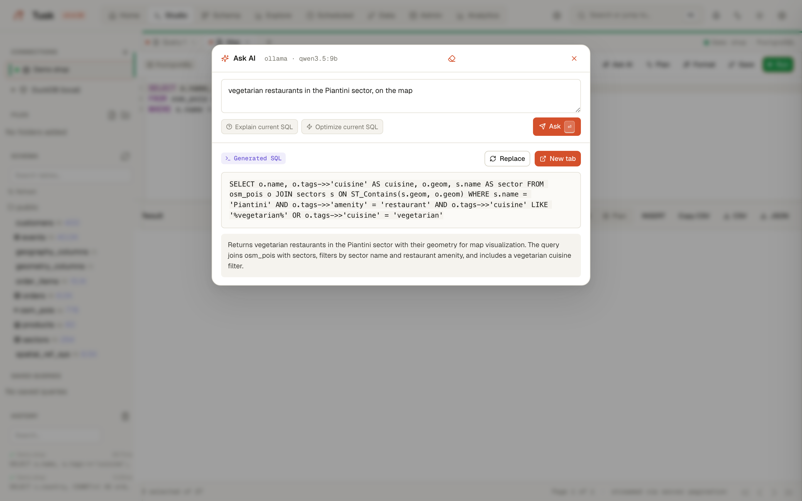

# MCP server

{ .screenshot }

Tusk exposes its connections to AI agents through the
[Model Context Protocol](https://modelcontextprotocol.io). Claude Code,
Cursor, Claude Desktop or any MCP client can list your connections, read a
schema and run read-only queries — through the same process, the same
connections and the same permissions as the web UI. Nothing to install or
run separately: the server is part of `tusk studio`.

Endpoint: `POST /mcp` (Streamable HTTP).

## Connect a client

Single-user mode (the default, local use):

```bash
claude mcp add --transport http tusk http://127.0.0.1:8000/mcp
```

Multi-user mode: create a personal API token (Profile → API tokens, or
`tusk auth token create <user> <name>`) and send it as a Bearer header. The
agent acts as that user — same connections, same permissions.

```bash
claude mcp add --transport http tusk http://tusk.example.com/mcp \
  --header "Authorization: Bearer tusk_..."
```

Cursor and other clients: add an HTTP MCP server with the same URL and, in
multi-user mode, the same `Authorization` header.

## Tools

All tools are **read-only**. A query that inserts, updates, deletes, alters
or otherwise changes state is refused before it reaches the database — this
also covers writing CTEs (`WITH … DELETE …`) and functions such as
`pg_sleep`. Result sets are capped (`limit`, default 200, max 1000) and the
response says whether the cap was hit.

| Tool | What it does |
|---|---|
| `list_connections` | Configured connections: id, name, type, host, database. |
| `get_schema(connection_id, focus?)` | Every table with row counts, plus full columns / PK / FK for the tables matching `focus` (a table or column name, or a few keywords). PostgreSQL only. This is the same grounding the [AI Copilot](copilot.md) uses, including the spatial catalog, sampled column values and place-name matches for `focus`. |
| `run_query(connection_id, sql, limit?)` | One `SELECT` / `WITH` / `VALUES` statement on a PostgreSQL, DuckDB or SQLite connection. When a result column holds geometry (PostGIS, WKT, GeoJSON) the response also carries `geometry_column` and a GeoJSON `FeatureCollection` in `geojson`, ready for a map. |
| `explain_query(connection_id, sql, analyze?)` | PostgreSQL execution plan as text lines. `analyze=true` runs the query. |
| `list_saved_queries(connection_id?)` | The queries you saved in Studio. |
| `run_saved_query(query_id, connection_id?, limit?)` | Run a saved query — vetted SQL the agent should prefer over writing its own. |

A useful first prompt: *"Using the tusk tools, list the connections, look at
the schema of `<database>` around `orders`, and tell me the ten customers
with the most orders this month."*

## Audit

Every tool call is written to the audit log (Admin → Audit) as
`mcp.<tool>` with the user, the connection and the SQL, including queries
that were refused (`mcp.run_query.rejected`). Log lines emitted while the
call runs carry the username as well.

## What it deliberately does not do

- Write to a database. If an agent needs to change data, it can hand you
  the SQL and you run it in Studio.
- Bypass permissions: a token is the user, no more.
- Work anonymously in multi-user mode: no token, no access.

## Implementation notes

The tools are ordinary Litestar routes in `src/tusk/studio/routes/mcp_tools.py`,
marked with `mcp_tool=`; the [litestar-mcp](https://litestar.dev/plugins/litestar-mcp/)
plugin serves them over JSON-RPC. `/mcp` is exempt from CSRF (an agent
carries no cookie) and inherits the session/token middleware.
