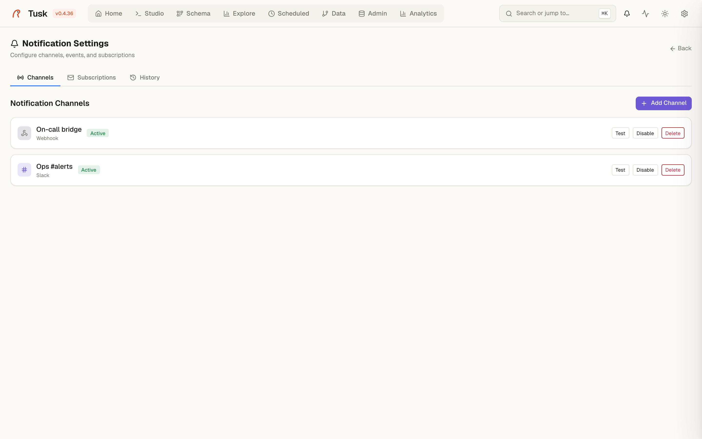
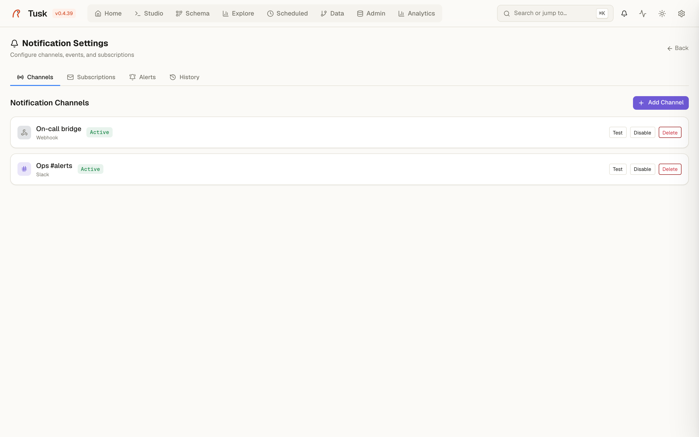

# Notifications

{ .screenshot }

Tusk raises events — a scheduled job failed, a backup finished, the schema
changed, a contract broke, a user was created — and you decide which of
them reach you and where. The bell in the header shows the in-app feed;
**Settings → Notifications** configures the rest.

## Channels

| Type | Needs |
|---|---|
| **Slack** / **Discord** | An incoming-webhook URL. |
| **Telegram** | Bot token + chat id. |
| **Email (SMTP)** | Host, port, credentials, from/to addresses. |
| **Custom webhook** | Any URL; receives the event as JSON (`event`, `title`, `message`, `variant`, `context`, `timestamp`). |

Every channel has a **Test** button that sends a sample message before you
wire it to anything.

Webhook and Slack/Discord URLs pointing at private networks are refused
unless `TUSK_ALLOW_PRIVATE_WEBHOOKS=1` is set — a self-hosted Tusk should
not be usable as a proxy into its own LAN.

## Subscriptions

A subscription is *event → channel*. Events are grouped by origin:

- `scheduler.job.success` / `scheduler.job.error` — [Scheduled](scheduled.md)
- `core.backup.completed` / `core.backup.failed`
- `core.download.completed` / `core.download.failed` — open-data downloads
- `schema.changed` — [Schema Watch](schema-watch.md)
- `contract.violated` / `contract.restored` — [Data Contracts](data-contracts.md)
- `core.user.created`
- events registered by plugins (Analytics: dashboard refresh)

Unsubscribed events still land in the in-app feed. Noisy events are
rate-limited per event key, so a flapping check does not page you every
minute.

## Alert rules

{ .screenshot }

**Settings → Notifications → Alerts.** A rule watches one number and
notifies when it crosses a threshold:

> when *Connections used* **>** 80 % for 120 s → `alert.fired`

What a rule can watch:

- an **Admin metric** of a PostgreSQL connection: connections used (%),
  active queries, cache hit ratio (%), database size (GB), longest running
  query (s);
- a **saved query** — the first numeric cell of its first row, run on the
  query's connection (read-only queries only);
- a **dashboard widget** — its query through the Analytics engine.

Rules are evaluated every minute. *For at least N seconds* means the
condition has to hold across consecutive checks before the rule fires;
`0` fires on the first breach. A rule fires **once** and stays `firing`
until the value comes back, which sends `alert.resolved`. Subscribe the
channels you want to those two events; each rule has its own rate-limit
slot, so two rules firing in the same minute are both delivered.

A rule whose source fails (connection down, query error) shows `error`
with the reason and does not page. **Evaluate now** runs a rule on demand,
**Pause** keeps it without checking. Creating and deleting rules is
audited.

## History

**Notification History** lists what was sent, to which channel, when, and
whether delivery succeeded — the first place to look when "the Slack
message never arrived".
