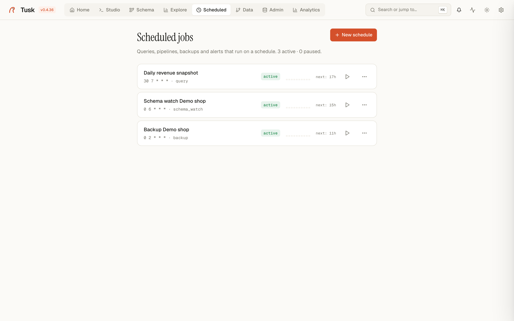

# Scheduled jobs

{ .screenshot }

Scheduled runs work on a cron, an interval or at one exact moment, inside the
Tusk process — no external cron, no sidecar. Jobs, their runs and their
output live in `~/.tusk/`.

## Job kinds

| Kind | What it does |
|---|---|
| **Backup** | `pg_dump` of a connection to a destination folder, in `custom`, `plain` or `directory` format. **Keep last N** prunes older files, so a daily backup does not fill the disk. |
| **Vacuum** / **Analyze** | Maintenance on a whole database or a list of tables. |
| **Query** | Run a SQL statement on a connection. Results can be saved as a snapshot (**Save results as**) and downloaded from the run history — a cheap way to keep a daily report. |
| **Pipeline** | Execute a pipeline saved on the [Data](data.md) page; each run's output file is kept and downloadable. |
| **Schema watch** | Snapshot the catalog and notify on drift — see [Schema Watch](schema-watch.md). |
| **Plugin** | A job a plugin registered (Analytics uses this for dashboard refreshes). |

## Triggers

- **Cron** — a standard five-field expression (`0 6 * * *`). The page shows
  the next run in your timezone.
- **Interval** — every N seconds, minutes or hours.
- **One-time** — at an exact moment; the job is removed after it runs.

A job can be paused and resumed, run on demand (**Run now**) and its trigger
changed without recreating it.

## Runs and notifications

Every run is recorded with start, duration, status and the error message
when it failed. Each run ends with a `scheduler.job.success` or
`scheduler.job.error` event; subscribe a channel to the error one under
[Notifications](notifications.md) to get Slack, Discord, Telegram, email or
a webhook call. Backups additionally emit `core.backup.completed` /
`core.backup.failed`.

## API

```
GET    /api/scheduler/jobs
POST   /api/scheduler/jobs/{backup|vacuum|analyze|query|pipeline|schema_watch|plugin}
POST   /api/scheduler/jobs/{id}/run | pause | resume
PUT    /api/scheduler/jobs/{id}/trigger
GET    /api/scheduler/jobs/{id}/runs
DELETE /api/scheduler/jobs/{id}
```

Jobs are owned by the user who created them in multi-user mode; admins see
all of them.
