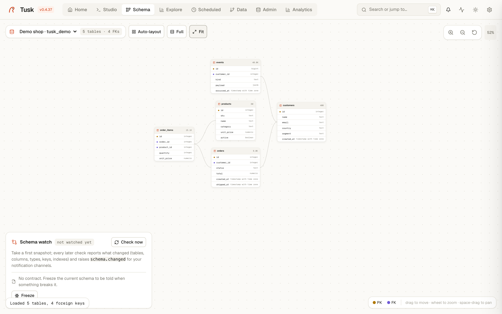

# Schema

An interactive ER diagram of a PostgreSQL connection. Tables are draggable
cards; foreign keys are curved lines between them. The page also hosts
[Schema Watch](schema-watch.md) and [Data Contracts](data-contracts.md) in
the bottom-left panel.

{ .screenshot }

## What you see

One card per table, listing its columns with their types. An amber dot marks
primary-key columns, a violet dot foreign keys. The header shows the
estimated row count.

Lines go from the referencing table (right edge) to the referenced one (left
edge). Click a table and its neighbours light up while everything else
fades; click the background to clear.

## Big schemas

Above 25 tables the diagram opens in **Compact** mode: each card shows only
its keys plus a footer such as *17 more columns*. Double-click a header (or
the footer) to expand that one table; the **Compact / Full** button switches
the whole diagram and re-arranges it.

Tables referenced by a large share of the schema (`users`, `company`,
`tenant`…) get a **N refs** badge and their lines are hidden at the
overview — they would cross everything and say nothing. Select the hub, or
any table pointing at it, and the lines appear.

When tables share a name prefix (`leasing_*`, `billing_*`, Django app
labels, Rails engines), each prefix becomes a labelled block laid out on its
own; otherwise blocks are connected components. Blocks are packed into rows
so the canvas stays roughly screen-shaped.

## Toolbar

- **Connection picker**: switching re-introspects `pg_catalog`.
- **Counter**: tables and foreign keys. Above 500 tables the response is
  capped and a badge says how many are shown.
- **Auto-layout**: arranges tables by their foreign keys (referencing left,
  referenced right) using the real card sizes, so cards never overlap. Runs
  automatically the first time a connection is opened.
- **Compact / Full**: see above.
- **Fit**: zooms to show the whole diagram.

## Interactions

- **Drag** a card to move it. Positions are saved on the server per
  connection and per user, so your arrangement survives reloads and other
  users keep theirs.
- **Wheel** zooms around the cursor; **Space + drag** pans; the buttons at
  the top-right do the same.
- **Click** a table to highlight its relations; **double-click** its header
  to expand or collapse it in compact mode.

## What it isn't

- **A migration tool.** Nothing here writes to the database.
- **A documentation generator.** Screenshot it if you need a picture in a
  wiki; for change tracking use Schema Watch.

## Related

- [schema-watch.md](schema-watch.md) — snapshots, diffs, notifications.
- [data-contracts.md](data-contracts.md) — freeze the shape you depend on.
- [explore.md](explore.md) — a single table's data rather than its structure.
