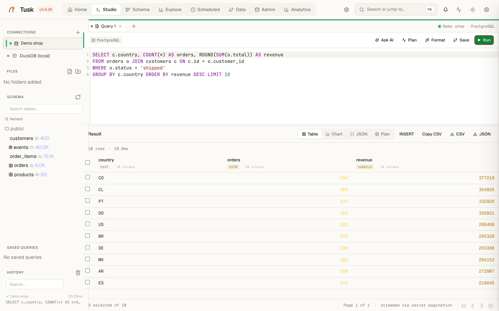
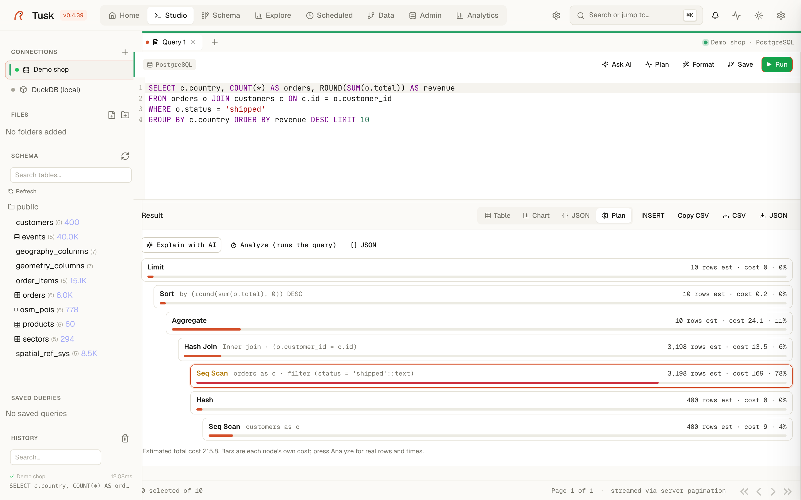
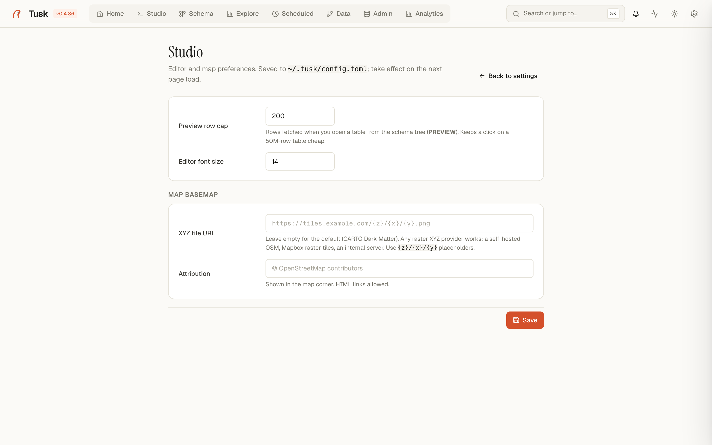

# Studio

The SQL editor. This is where the work happens.

{ .screenshot }

*Studio — SQL editor with results table, connection sidebar.*


## Layout

A three-column workspace with a top tab bar:

```
┌─────────────────────────────────────────────────────────────────┐
│ [Tusk]  Home  Studio  Schema  Explore  Scheduled  Data  Admin   │
├─────────────────────────────────────────────────────────────────┤
│ [Query 1] [History 20] [History 21] [+]              ● <conn>   │  ← tab bar
├──────────┬──────────────────────────────────────────────────────┤
│ CONNS    │ [PostgreSQL]      Ask AI · Plan · Format · Save · Run│
│ ● db-1   │  1  SELECT * FROM regions                            │  ← editor
│ ● db-2   │                                                       │
│ ● db-3   │                                                       │
├──────────┼──────────────────────────────────────────────────────┤
│ FILES    │ Result · 14,262 rows · 3.1ms                          │  ← results
│          │ [Table] [Map] [Chart] [JSON] [Plan]    Copy CSV  …    │
│ SCHEMA   │ id    level  code     name              latitude      │
│ — table1 │ ...   ...    ...      ...               ...            │
│ — table2 │                                                       │
└──────────┴───────────────────────────────────────────────────────┘
```

## The tab bar

Multiple queries open simultaneously, browser-style. Each tab carries its own:

- SQL text + cursor position
- Selected connection
- Last-run timestamp + row count
- "Dirty" indicator (orange dot) when unsaved changes vs the last run

The right side of the bar shows the **active connection chip** with a colored dot — green for healthy, amber for connecting, red for failed. Click it to pick a different connection without leaving the tab.

## The connections sidebar

Lists every configured Postgres + DuckDB source in your `~/.tusk/connections.toml`. Each row:

- A status dot (green = pool healthy, amber = idle but reachable, red = failure).
- The connection name.
- An icon: database for Postgres, box for DuckDB, folder for file-based sources.

Right-click any connection for: Test connection · Reconnect · Edit · Remove.

Below it the **Files** section is a workspace bookmark area (drag a `.sql` file in to save it).

## The schema panel (bottom-left)

When you select a table in the sidebar's Schema panel, the editor gets context — autocompletion knows the columns, AI Copilot grounds in the schema, and Format respects the table's column casing.

The schema panel itself is a **live introspection** of the connected database — not a cached snapshot. When the schema drifts (a column is renamed remotely), the next query refresh pulls the new shape and Copilot flags the drift in its suggestions.

## The editor

Monaco-based (the VS Code engine). Features:

- **Syntax highlighting** for PostgreSQL flavor SQL.
- **Autocomplete** of table names, column names, function names from the connection's introspected schema.
- **Inline lint markers** for syntax errors as you type.
- **AI Copilot** (`Ask AI` button) opens a side panel that takes natural language and emits SQL grounded in the active schema.
- **`Plan`** runs `EXPLAIN ANALYZE` against the current SQL and renders the plan tree (no execution against your actual data).
- **`Format`** prettifies SQL via a server-side pgfmt-ish formatter.
- **Keyboard**: `⌘+Enter` runs, `⌘+S` saves, `⌘+/` toggles comment.

## Results

Five render modes, switchable without re-running the query:

| Mode | When to use |
|---|---|
| **Table** | Default. Sortable columns, sticky header, server-side pagination for large results (you only fetch the rows you scroll to). |
| **Map** | Auto-detected when the result has `lat` / `lng` columns (or a PostGIS geometry). MapLibre tile renderer with optional bubbles mode. |
| **Chart** | Auto-suggests chart type based on column shapes (categorical x + numeric y → bar; time x + numeric y → line). |
| **JSON** | Raw result as JSON for copy/paste / debugging. |
| **Plan** | If you ran `EXPLAIN ANALYZE`, shows the parsed plan tree. |

Above the table: `INSERT` (writes a new row via a generated form), `Copy CSV`, `CSV` download, `JSON` download.

The header strip notes how many rows came back, how long it took, and whether the result was **streamed via server pagination** (for >10K rows) vs fetched whole.

## History

Every query you run lands in `~/.tusk/history.db`. The bottom of the connections sidebar shows the last 50, searchable. Click any to reopen.

## Why Studio matters

Most tools force you to commit to a connection or a saved query. Studio's bet is that **fast iteration** beats organization: open a tab, write SQL, run, look at results in three different modes, copy to a new tab, edit, run. The history table is the safety net — every iteration is recoverable.

## Keyboard reference

| Key | Action |
|---|---|
| `⌘+Enter` | Run current query |
| `⌘+T` | New tab |
| `⌘+W` | Close current tab |
| `⌘+S` | Save query (named) |
| `⌘+K` | Open command palette (jump to any feature) |
| `⌘+/` | Toggle comment |
| `Esc` | Close AI Copilot panel |

## Related

- [home.md](home.md) — the "New query" button lands here.
- [schema.md](schema.md) — for understanding the schema this editor autocompletes from.
- [analytics.md](analytics.md) — save a query as a dashboard widget.

## Connection colour

Give a connection a colour when you add or edit it (red for production,
amber for staging, green for development — or any of the presets). The
colour tints the tab strip and the editor header, marks the
active-connection badge and stripes the connection list, so a production
tab never looks like a development tab. Colours are stored with the
connection.

## Preview a table

Every table in the schema tree has a **PREVIEW** action: it opens a new tab
with `SELECT * FROM … LIMIT <cap>` and runs it. The cap (200 rows by
default) lives in **Settings → Studio**, which keeps an accidental click on
a 50M-row table cheap. Double-click still inserts the table name at the
cursor; **INSERT** still opens an insert template.

## Read a plan

The **Plan** tab draws `EXPLAIN` as a tree of cards: node type, the table
or index and the condition, estimated rows and the node's own cost, with a
bar for its share of the whole plan (children excluded). The costliest
node is highlighted; a sequential scan over many rows is flagged.
**Analyze** runs the query and adds real rows and times, marking the
nodes where the planner's estimate was far off. **JSON** shows the raw
plan.

## Explain a plan with AI

{ .screenshot }

In the **Plan** tab, **Explain with AI** sends the EXPLAIN output together
with the SQL and the schema the Copilot already grounds on. You get a
short summary of what the planner does, the nodes that dominate the cost
and ordered suggestions — an index with its columns, a rewrite, `ANALYZE`,
a configuration knob — or a plain "this plan is fine". It uses the same
provider as the rest of the Copilot (Settings → AI Copilot).

## Studio settings

{ .screenshot }

**Settings → Studio** holds the preview row cap, the editor font size and
a custom XYZ basemap for the map views (URL with `{z}/{x}/{y}` placeholders
plus attribution) — a self-hosted OSM, Mapbox raster tiles or an internal
tile server instead of the default OpenFreeMap basemap (keyless vector tiles, light or dark to match the theme).

## Saved queries as vector tiles

A saved query with a geometry column can be served as Mapbox Vector Tiles
(the **layers** button next to a saved query copies the URL):

```
GET /api/tiles/<query id>/tilejson             # TileJSON: tiles URL, bounds, fields
GET /api/tiles/<query id>/{z}/{x}/{y}          # one tile, straight from ST_AsMVT
```

Point a MapLibre `vector` source at the TileJSON and every non-geometry
column of the query is a feature property, layer name `query`. The query
runs inside `ST_AsMVT` per tile — no GeoJSON export, no copy, always the
current data. Read-only queries on PostgreSQL connections only. In
multi-user mode append `?token=tusk_…` (Profile → API tokens); tile
requests cannot carry headers.

```js
map.addSource('shops', { type: 'vector', url: 'https://tusk.example.com/api/tiles/12/tilejson?token=tusk_…' });
map.addLayer({ id: 'shops', type: 'circle', source: 'shops', 'source-layer': 'query' });
```

## Deep links

`/studio?connection=<id>&sql=<sql>&map=1&title=<name>` selects the
connection, opens the SQL in a new tab, runs it and switches to the map
view. Add `run=0` to only open the tab. The **Open in map** buttons on the
Spatial cards (Admin, Explore) use it.
